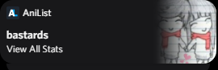
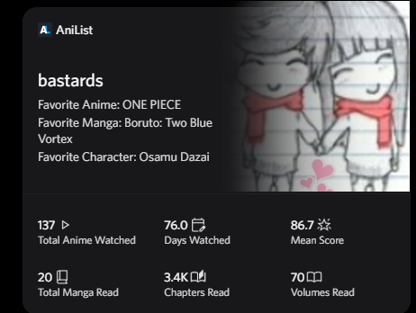

  
  
  
  

  <h1>📺 AniList to Discord Widget Sync</h1>
  

    <b>A lightweight Node.js Discord bot that syncs your AniList anime & manga statistics directly to your custom Discord application profile widget — complete with favorites and slash command controls.</b>
  

  ---

 

<h2 align="center">📋 System Requirements</h2>

<table align="center" width="100%">
  <thead>
    <tr align="left">
      <th width="30%">Item</th>
      <th width="70%">Specification</th>
    </tr>
  </thead>
  <tbody>
    <tr>
      <td><b>Runtime Environment</b></td>
      <td><code>Node.js 18</code> or newer (with <code>npm</code>)</td>
    </tr>
    <tr>
      <td><b>Source Profile</b></td>
      <td>An <b>AniList</b> account (linked via OAuth2)</td>
    </tr>
    <tr>
      <td><b>Target Destination</b></td>
      <td>A <b>Discord developer application</b> with a profile widget layout</td>
    </tr>
  </tbody>
</table>

 

<h2 align="center">⚙️ Setup & Installation</h2>

<ol>
  <li>
    <b>Clone the repository:</b>
    <pre><code>git clone https://github.com/100000000000000000001/Ani-List-Widget.git
cd Ani-List-Widget</code></pre>
  </li>
  <li>
    <b>Install dependencies:</b>
    <pre><code>npm install</code></pre>
  </li>
  <li>
    <b>Configure environment variables:</b>
    
Create a file named <code>.env</code> in the root directory:

    <pre><code>DISCORD_BOT_TOKEN=your_discord_bot_token
APPLICATION_ID=your_discord_application_id
DISCORD_USER_ID=your_discord_user_id
ANILIST_CLIENT_ID=your_anilist_client_id
ANILIST_CLIENT_SECRET=your_anilist_client_secret</code></pre>
  </li>
  <li>
    <b>Import the widget layout:</b>
    
Use the included <code>discord_portal.json</code> with the <a href="https://github.com/ItzMeShadow999/Discord_Widget_Configurator" target="_blank">Discord Widget Configurator</a> to import your widget layout into the Discord Developer Portal.

  </li>
  <li>
    <b>Start the bot:</b>
    <pre><code>node sync.js</code></pre>
  </li>
</ol>

 

<h2 align="center">🌐 Environment Variables</h2>

<table align="center" width="100%">
  <thead>
    <tr align="left">
      <th width="25%">Variable Name</th>
      <th width="15%">Required</th>
      <th width="60%">Description</th>
    </tr>
  </thead>
  <tbody>
    <tr>
      <td><code>DISCORD_BOT_TOKEN</code></td>
      <td><b>Yes</b></td>
      <td>Your Discord bot token (used to authenticate API requests).</td>
    </tr>
    <tr>
      <td><code>APPLICATION_ID</code></td>
      <td><b>Yes</b></td>
      <td>Your Discord Developer Application ID.</td>
    </tr>
    <tr>
      <td><code>DISCORD_USER_ID</code></td>
      <td><b>Yes</b></td>
      <td>Your numeric Discord User ID.</td>
    </tr>
    <tr>
      <td><code>ANILIST_CLIENT_ID</code></td>
      <td><b>Yes</b></td>
      <td>Your AniList API client ID (from <a href="https://anilist.co/settings/developer" target="_blank">AniList Developer Settings</a>).</td>
    </tr>
    <tr>
      <td><code>ANILIST_CLIENT_SECRET</code></td>
      <td><b>Yes</b></td>
      <td>Your AniList API client secret.</td>
    </tr>
  </tbody>
</table>

 

<h2 align="center">🤖 Slash Commands</h2>

<table align="center" width="100%">
  <thead>
    <tr align="left">
      <th width="25%">Command</th>
      <th width="75%">Description</th>
    </tr>
  </thead>
  <tbody>
    <tr>
      <td><code>/link</code></td>
      <td>Links your AniList account via OAuth2. Run without arguments to get the authorization URL, then run again with the code.</td>
    </tr>
    <tr>
      <td><code>/config</code></td>
      <td>Set your favorite anime, manga, or character to display on your widget. Supports autocomplete search and AniList IDs.</td>
    </tr>
    <tr>
      <td><code>/refresh</code></td>
      <td>Forces an immediate sync of your AniList stats to your Discord widget.</td>
    </tr>
  </tbody>
</table>

 

<h2 align="center">📊 Widget Data Fields</h2>

<table align="center" width="100%">
  <thead>
    <tr align="left">
      <th width="30%">Widget Surface</th>
      <th width="70%">Rendered Fields</th>
    </tr>
  </thead>
  <tbody>
    <tr>
      <td><b>Hero Banner</b></td>
      <td><code>username</code>, <code>avatar</code>, <code>favorite anime</code>, <code>favorite manga</code>, <code>favorite character</code></td>
    </tr>
    <tr>
      <td><b>Statistics Grid</b></td>
      <td><code>total anime</code>, <code>days watched</code>, <code>mean score</code>, <code>total manga</code>, <code>chapters read</code>, <code>volumes read</code></td>
    </tr>
    <tr>
      <td><b>Mini Profile</b></td>
      <td><code>username</code>, <code>avatar</code></td>
    </tr>
  </tbody>
</table>

 

<h2 align="center">🖼️ Widget Showcase</h2>

  <table border="0" cellspacing="10" cellpadding="0">
    <tr>
      <td align="center" valign="top">
        <h4>Mini Profile Preview</h4>
        
      </td>
      <td align="center" valign="top">
        <h4>Full Widget Layout</h4>
        
      </td>
    </tr>
  </table>

 

<h2 align="center">💡 Important Notes</h2>

<ul>
  <li><b>Owner Only:</b> The bot only responds to commands from the <code>DISCORD_USER_ID</code> specified in your <code>.env</code> file.</li>
  <li><b>Manual Refresh:</b> Stats are updated on-demand via the <code>/refresh</code> command — there is no automatic sync interval.</li>
  <li><b>AniList OAuth:</b> Your AniList access token is stored locally in <code>store.json</code>. If it expires, simply run <code>/link</code> again.</li>
  <li><b>Favorites Persistence:</b> Your configured favorites (anime, manga, character) are saved in <code>store.json</code> and persist across restarts.</li>
  <li><b>Security:</b> Never share or commit your <code>.env</code> or <code>store.json</code> files.</li>
</ul>

 

<h2 align="center">📁 Project Structure</h2>

<pre><code>Ani-List-Widget/
├── sync.js              # Main bot script
├── discord_portal.json   # Widget layout for Discord Developer Portal
├── store.json            # Local storage (auto-generated, do not commit)
├── .env                  # Environment variables (do not commit)
├── package.json          # Node.js dependencies
└── assets/               # Screenshot images for README
    ├── widget-mini-preview.png
    └── widget-full-preview.png
</code></pre>

 

  
Released under the <a href="LICENSE">MIT License</a>.

